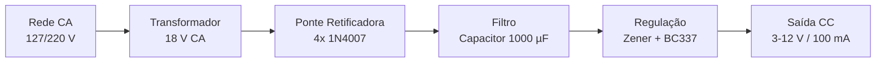

## INTRODUÇÃO

Este projeto detalha o desenvolvimento de uma **fonte de alimentação linear ajustável**, projetada para converter a tensão alternada da rede elétrica em tensão contínua estável. O circuito utiliza uma topologia clássica de regulação série com transistor e diodo Zener, fornecendo até **100 mA** de corrente de saída.

## OBJETIVO

O objetivo desta atividade é projetar e montar uma fonte de 100 mA, que correspondam as seguintes características:

- **Tensão de entrada** de 127 V ou 220 V (rede CA).
- **Tensão de saída** ajustável entre 3 V e 12 V.
- **Corrente máxima** 100 mA.
- Manter a tensão de saída constante mesmo com pequenas variações na entrada.

##  DIAGRAMA DE BLOCOS
 

## METODOLOGIA

O projeto foi dividido em quatro partes:

- Redução da tensão de rede (220 V / 127 V) para 18 V CA via transformador externo.
- Conversão em onda completa por meio de uma ponte montada manualmente com quatro diodos 1N4007.
- Suavização da tensão pulsante através de um capacitor eletrolítico de 1000 µF.
- Estabilização da saída pelo transistor BC337, tendo como referência um diodo Zener de 13 V e um potenciômetro para controle da faixa de saída.

## COMPONENTES

| Componente | Função Técnica | Resumo |
| :--- | :--- | :--- |
| **Transformador** | Redução de tensão | Reduz a tensão CA da rede para um nível seguro e adequado ao restante do circuito. |
| **Diodos (Ponte)** | Retificação | Quatro diodos em ponte retificadora permitem alimentação independente da polaridade do ciclo CA. |
| **Capacitor** | Filtragem | Armazena e libera carga para suavizar o *ripple*, mantendo o fluxo de tensão mais constante. |
| **LED** | Sinalização | Indica visualmente a presença de corrente no circuito|
| **Diodo Zener** | Referência de tensão | Limita a tensão máxima em 13 V. |
| **Potenciômetro** | Controle de saída | Resistência variável permitindo ajustar a tensão de saída entre 3 V e 12 V. |
| **Resistores** | Limitação de corrente | Protegem componentes como o LED e o Zener contra o excesso de corrente. |
| **Transistor** | Regulação de potência | Regula a corrente entregue à carga com base na tensão de referência do Zener, garante saída estável de até 100 mA. |

---

### Lista de Materiais e Orçamento 

| Componente | Componente Utilizado | Qtd. | Preço Unit. | Subtotal |
| :--- | :--- | :---: | :---: | :---: |
| Transformador | Trafo Bivolt 18+18 V / 200 mA | 1 | R$ 27,99 | R$ 27,99 |
| Diodos |  Diodo 1N4007 | 4 | R$ 0,13 | R$ 0,52 |
| Capacitor | 1000 µF / 50 V | 1 | R$ 1,20 | R$ 1,20 |
| Diodo Zener |1N4743 (13 V / 1 W) | 1 | R$ 0,22 | R$ 0,22 |
| Transistor |  NPN BC337 (500 mA) | 1 | R$ 0,32 | R$ 0,32 |
| Potenciômetro |10 kΩ Linear | 1 | R$ 1,92 | R$ 1,92 |
| Resistor (LED) | 3,3 kΩ 5% (1 W) | 1 | R$ 0,24 | R$ 0,24 |
| Resistor (Zener) |  3,3 kΩ 5% (1 W) | 1 | R$ 0,24 | R$ 0,24 |
| Resistor (Coletor) |  82 Ω 5% (1 W) | 1 | R$ 0,24 | R$ 0,24 |
| Resistor (Divisor) |  3,3 kΩ 5% (1 W) | 1 | R$ 0,24 | R$ 0,24 |
| LED | LED Difuso 5 mm | 1 | R$ 0,24 | R$ 0,24 |
| **Total** | | |  | **R$ 33,37** |
 
---
 

## CIRCUITO FALSTAD

[Acesse aqui](https://is.gd/1eZoAe)

## RELATÓRIO

O circuito é dividido em quatro blocos funcionais: transformação, retificação, filtragem e regulação. Cada bloco foi dimensionado com componentes que atendem aos requisitos da disciplina SSC0180. A seguir, cada etapa do projeto é explicada e calculada individualmente.

### Transformador

O primeiro passo da fonte é reduzir a tensão da rede elétrica (127 V ou 220 V) para um nível seguro e adequado ao restante do circuito. 

Utilizei um transformador bivolt com saída de **18 V CA**, valor escolhido para garantir que, mesmo após as quedas de tensão nos diodos da ponte (~1,4 V) e o ripple do capacitor, ainda reste tensão suficiente para o transistor regular a saída até 12 V com folga.
 
**Tensão de pico após o transformador:**

$$V_{pico} = 18 \times \sqrt{2} \approx 25{,}4\text{ V}$$
 
**Tensão CC após a ponte (queda de 0,7 V por diodo, dois em condução simultânea):**

$$V_{CC} = 25{,}4 - 2 \times 0{,}7 \approx 24\text{ V}$$

---

###  Ponte Retificadora — 1N4007 × 4

A corrente alternada proveniente do transformador precisa ser convertida em corrente contínua para alimentar os estágios seguintes. Para isso, utilizei uma **ponte de Graetz** composta por quatro diodos 1N4007 dispostos em configuração de onda completa, que aproveita os dois semiciclos da CA.

O diodo 1N4007 foi escolhido por suportar até **1 A de corrente** e **1000 V de tensão reversa**, oferecendo uma margem de segurança para os 100 mA exigidos. Cada diodo apresenta uma queda de tensão direta de aproximadamente 0,7 V, resultando em queda total de 1,4 V na ponte (dois diodos conduzem simultaneamente).

---

### Capacitor de Filtro — 1000 µF / 50 V

Após a retificação, a tensão ainda apresenta uma oscilação chamada **ripple**, pois segue o formato pulsante da onda retificada. O capacitor eletrolítico em paralelo com a carga armazena carga elétrica e a libera nos vales da tensão, suavizando essa oscilação e mantendo a tensão mais estável.

Escolhi **1000 µF** para garantir um ripple baixo mesmo na corrente máxima de 100 mA. O valor de **50 V** de tensão suportada oferece o dobro de margem em relação ao pico de tensão do circuito (~25 V), garantindo segurança contra picos transitórios da rede.

**Cálculo do ripple para corrente máxima de 100 mA e frequência de 60 Hz:**

$$\Delta V = \frac{I_{carga}}{2 \times f \times C} = \frac{0{,}1}{2 \times 60 \times 0{,}001} \approx 0{,}83\text{ V}$$

**Tensão mínima disponível após o ripple:**

$$V_{min} = 24 - 0{,}83 \approx 23{,}2\text{ V}$$

> Com 1000 µF, o ripple de ~0,83 V é pequeno o suficiente para não comprometer a regulação do transistor.

 
**Critério ideal (orientação do professor):** o ripple não deve superar **10% da tensão CC** de entrada do filtro.
 
$$\Delta V_{ideal} = 10\% \times V_{CC} = 0{,}10 \times 24 \approx 2{,}4\text{ V}$$
 
**Capacitância mínima para atender a esse critério**, na corrente máxima de projeto (100 mA) e frequência de ripple de onda completa (2×60 Hz = 120 Hz):
 
$$C_{ideal} = \frac{I_{carga}}{2 \times f \times \Delta V_{ideal}} = \frac{0{,}1}{2 \times 60 \times 2{,}4} \approx 347\ \mu F$$
 
Qualquer capacitor **≥ 347 µF** já atenderia ao critério de 10% do professor.
 
**Capacitor disponível e utilizado:** 1000 µF / 50 V (o que eu tinha disponível, acima do mínimo ideal calculado).

---

###  Resistor do Zener — 3,3 kΩ

O diodo Zener precisa de um resistor em série para **limitar a corrente** que passa por ele. Sem o resistor, o Zener ficaria ligado quase diretamente entre VCC e GND, e a corrente seria limitada apenas pela resistência interna do circuito, queimando o componente.

O resistor de **3,3kΩ** foi escolhido por ser o valor mais próximo do ideal calculado (~3 kΩ). Ele limita a corrente do Zener a um valor seguro, mantendo a tensão de referência estável em 13 V sem dissipar potência excessiva.

**Corrente total pelo resistor de 3,3 kΩ:**  

$$I_{total} = \frac{V_{CC} - V_Z}{R} = \frac{24 - 13}{3300} \approx 3{,}33\text{ mA}$$
 

**Corrente efetiva pelo Zener:**

$$I_Z = I_{total} - I_{divisor} \approx 3{,}33 - 0{,}98 \approx 2{,}35\text{ mA}$$
 
**Potência no resistor de 3,3 kΩ:**

$$P_R = I_{total}^2 \times R = (0{,}00333)^2 \times 3300 \approx 36{,}6\text{ mW}$$
 
**Potência no Zener:**

$$P_Z = V_Z \times I_Z = 13 \times 0{,}00235 \approx 30{,}5\text{ mW}$$

---

### Diodo Zener — 1N4743 (13 V / 1 W)

O Zener define a **tensão de referência** do circuito. Ele conduz em modo reverso sempre que a tensão em seus terminais atinge sua tensão de ruptura (13 V), mantendo esse valor constante independentemente de variações na entrada.

Escolhi o **1N4743 de 13 V** porque, ao descontar a queda $V_{BE}$ de 0,7 V do transistor BC337, a tensão máxima de saída fica em aproximadamente **12,3 V**, superando a meta de 12 V do projeto. Zeners com tensão menor não atingiriam os 12 V de saída, tensões maiores elevariam demais a dissipação no transistor.

---

### Divisor de Base — Pot 10 kΩ + R 3,3 kΩ

O potenciômetro e o resistor de 1,2 kΩ formam um **divisor de tensão** que controla a tensão aplicada à base do transistor BC337. Variando o potenciômetro, ajusta a tensão na base e a tensão de saída da fonte.

O resistor de **3,3 kΩ** em série limita a corrente máxima de base (protegendo o BC337 caso o potenciômetro seja girado ao extremo) e garante que o transistor opere na **região ativa linear**, essencial para a regulação estável da tensão.

A resistência total do divisor é constante (independe da posição do cursor):

$$R_{total} = R_{pot} + R_{fixo} = 10000 + 3300 = 13300\ \Omega$$
 
A tensão na base depende de onde o cursor "corta" essa cadeia. Chamando de $R_{topo}$ a resistência entre a referência e o cursor:

$$V_B = V_Z \times \frac{R_{total} - R_{topo}}{R_{total}}$$
 
**Cursor no extremo de saída máxima** ($R_{topo} \approx 50\ \Omega$, valor indicado na simulação):

$$V_{B_{max}} = 13 \times \frac{13300 - 50}{13300} \approx 12{,}95\text{ V}$$

$$V_{out_{max}} = 12{,}95 - 0{,}7 \approx 12{,}25\text{ V}$$
 
 
**Cursor no extremo de saída mínima** ($R_{topo} = 10000\ \Omega$, pot todo do outro lado):

$$V_{B_{min}} = 13 \times \frac{3300}{13300} \approx 3{,}23\text{ V}$$

$$V_{out_{min}} = 3{,}23 - 0{,}7 \approx 2{,}53\text{ V}$$
 
Nos testes em bancada o potenciômetro no extremo de saída mínima, o multímetro mediu 2,95 V na saída . A diferença é esperada e vem das tolerâncias dos componentes reais (Zener 1N4743 com tolerância de ±5%, resistores de 3,3 kΩ com 5% cada) e da pequena corrente de base do BC337 carregando o nó do divisor, efeito que o cálculo simplificado não captura. O valor medido confirma que o circuito físico atende com folga a meta de projeto de 3 V.

A faixa real (~2,5–2,95 V a ~12,25–12,51 V) cobre confortavelmente a meta de projeto de 3 V a 12 V.

---

### Transistor BC337

O BC337 opera como **seguidor de emissor** (emitter follower), ele entrega à carga a tensão imposta pelo divisor de base, menos a queda $V_{BE}$, com capacidade de fornecer até 100 mA sem que o circuito de referência (Zener + potenciômetro) precise fornecer essa corrente diretamente.

A escolha do **BC337** se justifica por seu limite de 500 mA de corrente de coletor, bem maior do que a necessária para este projeto. O único ponto de atenção é a potência dissipada em condições extremas, pois fontes lineares convertem a diferença entre entrada e saída em calor no transistor.

**Pior caso de projeto** (saída em 3 V, carga de 100 mA):
 
Queda total a ser dissipada entre VCC e a saída:

$$\Delta V_{total} = V_{CC} - V_{out} = 24 - 3 = 21\text{ V}$$
 
Queda no resistor de 82 Ω:

$$V_{82\Omega} = I \times R = 0{,}1 \times 82 = 8{,}2\text{ V}$$
 
Tensão restante sobre o transistor (VCE):

$$V_{CE} = 21 - 8{,}2 = 12{,}8\text{ V}$$
 
**Potência dissipada no resistor de 82 Ω:**

$$P_{82\Omega} = I^2 \times R = (0{,}1)^2 \times 82 = 0{,}82\text{ W}$$
 
**Potência dissipada no transistor:**

$$P_{Q1} = V_{CE} \times I = 12{,}8 \times 0{,}1 = 1{,}28\text{ W}$$

---

### Resistor do LED — 3,3 kΩ / 1 W

O LED serve como **indicador visual** de que a fonte está energizada. Como qualquer LED, ele precisa de um resistor limitador de corrente para não queimar, pois sua resistência interna é muito baixa e sem limitação a corrente seria destrutiva.

O resistor de **3,3 kΩ** foi escolhido para manter a corrente do LED dentro da faixa segura (~20 mA), garantindo brilho adequado sem risco de dano. A especificação de **1 W** garante folga térmica confortável, atendendo ao requisito mínimo de 1/2 W da disciplina.

**Corrente pelo LED** (queda de tensão no LED ≈ 2 V):

$$I_{LED} = \frac{V_{CC} - V_{LED}}{R} = \frac{24 - 2}{3300} \approx 6{,}67\text{ mA}$$
 
**Potência no resistor:**

$$P_R = I^2 \times R = (0{,}00667)^2 \times 3300 \approx 147\text{ mW}$$
 
> Com 3,3 kΩ o LED acende com brilho mais discreto (~6,7 mA) do que o calculado antes (~22 mA), mas ainda dentro da faixa segura de operação.

---

### Carga de Teste — R 1,2 kΩ

Para validar o funcionamento da fonte, utilizamos um resistor de **1,2 kΩ** como carga de teste. Ele simula um dispositivo real conectado à saída e permite verificar se a tensão se mantém estável e ajustável conforme o potenciômetro é variado.

**Corrente na carga:**

$$I_{carga} = \frac{V_{out}}{R} = \frac{12{,}51}{1200} \approx 10{,}4\text{ mA}$$
 
**Potência dissipada na carga:**

$$P = \frac{V^2}{R} = \frac{12{,}51^2}{1200} \approx 130\text{ mW}$$

---

## ESQUEMÁTICO DA PCB

## IMAGEM DA PCB 

## IMAGEM DO PROJETO

## VIDEO DO PROJETO

https://github.com/user-attachments/assets/ed489270-2d82-4a1b-8a04-cfdd67fa29f1

## CONCLUSÃO

A fonte projetada para a disciplina SSC0180 funcionou sem problemas com as especificações superiores às mínimas exigidas. O transistor BC337 em conjunto com a ponte retificadora de diodos 1N4007 garante operação estável a 100 mA, tornando a fonte uma ferramenta confiável para uso nos laboratórios do ICMC-USP.
